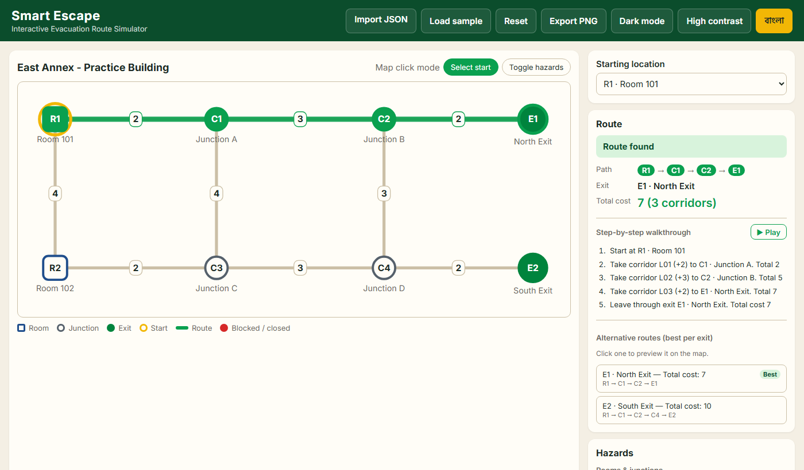
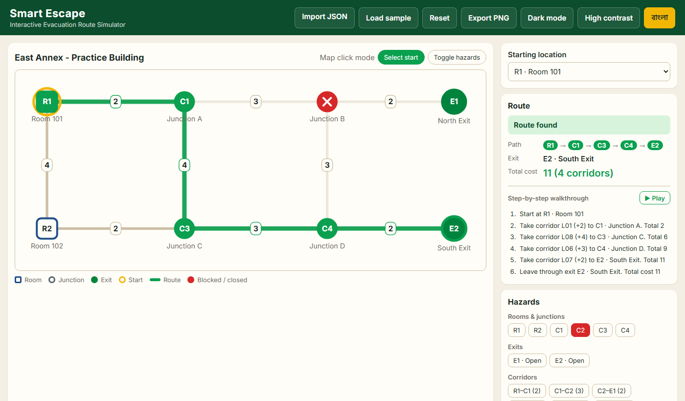
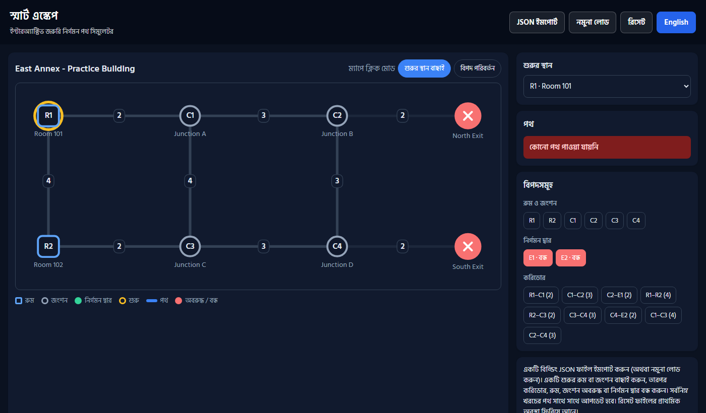

# Smart Escape: Interactive Evacuation Route Simulator

AI DevFest 2026 · Vibe Coding (Solo)

- **Name:** Md Abdul Quym Shanto
- **Registration number:** 044
- **Live link (HTTPS):** https://devfest-044.vercel.app/
- **Repository:** https://github.com/aqshanto/devfest--004-

> Educational simulation only, not a certified evacuation planning tool.

## How to run
No build step. Plain HTML/CSS/JS.

- **Online:** open the live link above in Chrome.
- **Locally:** `python -m http.server 5173` (or `npx serve .`) in the repo folder, then open `http://localhost:5173`.
  Opening `index.html` directly also works; only the auto-loaded sample needs http, so use **Import JSON** instead.
- **Tests:** `node test.js`

## Main features (mandatory tasks)
- **Import & validate** any building JSON with the official schema. Malformed or inconsistent files are rejected with a clear, itemised error list (count limits, duplicate IDs, unknown refs, self-loops, repeated pairs, non-positive/non-integer costs, wrong initial_state categories…).
- **Map** drawn in SVG at the supplied coordinates (uniformly scaled), with labels, distinct shapes and colours per node type (room = square, junction = circle, exit = green), and corridor costs on every edge.
- **Select start** from the dropdown or by clicking the map. The lowest-cost route is highlighted with its node sequence, exit and total cost.
- **Hazards:** block/unblock rooms, junctions and corridors, close/reopen exits, from the map (Toggle hazards mode, or click a corridor) or the side panel. Each state looks different: red ✕ node, red dashed corridor, dimmed unusable corridors.
- **Instant recalculation** after every change. **Reset** restores the file's `initial_state`.
- **Failure states:** `No route available` and `Starting location blocked`.
- **Bangla / English** toggle for all labels, buttons, statuses, errors and instructions. The choice is remembered.
- **Subtle animations:** route draw-in, node pop on select/toggle, status fade. `prefers-reduced-motion` is respected.

### Routing rules
Dijkstra over the graph with blocked nodes (and their incident edges), blocked edges and closed exits removed. Each node keeps its best `(cost, path)` pair, compared by cost and then by the lexicographic node-ID sequence. The chosen exit is the one with minimum cost, ties broken by the smallest exit ID. Cost is always the sum of edge costs, never coordinates or hop count. Logic is in `router.js`.

## Bonus features
- Keyboard-accessible map nodes (Tab + Enter) and focus outlines
- Light / dark theme follows the OS
- Responsive layout (works on mobile)
- Bundled sample auto-loads for a quick demo
- Shareable state via URL, e.g. `?start=R1&block=C2&close=E1&lang=bn`

## Screenshots
| Baseline (R1 → E1, cost 7) | After blocking C2 (R1 → E2, cost 11) |
|---|---|
|  |  |

Bangla mode, both exits closed → *No route available*:

## Known issues
- None known. The map auto-scales node coordinates to fit; very dense graphs (60 nodes) may have overlapping labels.

## AI tools used
- Claude Code (Claude Opus 5.5): planning, code generation, testing

## Most useful prompt
> "Read the problem PDF and rulebook, make plan.md, CLAUDE.md, AGENTS.md, then build the Smart Escape app: JSON import with validation, SVG map, Dijkstra route with tie-breaks, hazard toggles, reset, Bangla/English."

## License
MIT. See [LICENSE](LICENSE).
